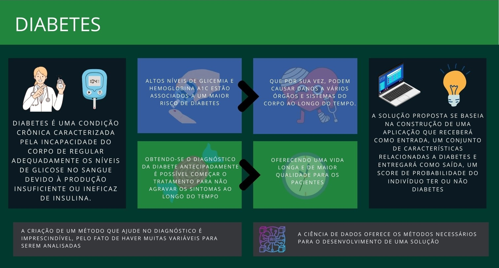

# Diabetes Prediction

## Resumo
Afetando 16,8% de adultos no Brasil, diabetes é um conjunto de doenças metabólicas caracterizadas pela dificuldade do organismo em controlar os níveis de glicose no sangue, mantendo-os elevados por muito tempo, podendo causar danos em vários órgãos. Sendo uma doença silenciosa, é estimado que cerca de 44,7% dos adultos com diabete não sabem que têm a doença, podendo levar a sérias complicações como derrame, cegueira, insuficiência renal e até a morte. Por conta disso, é relevante criar uma forma da população ter acesso a um método para facilitar a identificação da doença e estimular a procura de atendimento médico. O objetivo desse projeto é criar uma aplicação onde é inserido dados relacionados a diabete e entregará como saída, a probabilidade de um indivíduo ter diabetes. Utilizaremos o conjunto de dados [Diabetes-Prediction](https://www.kaggle.com/datasets/iammustafatz/diabetes-prediction-dataset) para construção do projeto

### Resumo Gráfico

 
## Desenvolvedores
 - [Rafael Andrade #1](https://github.com/RafaelAndradeDEV)
 - [Matheus Pereira #2](https://github.com/depaula304)
 - [Yago Castro #3](https://github.com/YagoCastro)
 - [Samuel Cadeira #4](https://github.com/Samu-634)
 
---
